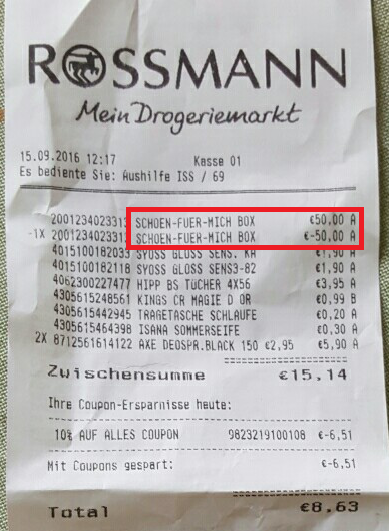

# DS Expert Track - Exercise

## Setup

1. If you haven't done so yet: Install 
[Anaconda for Python 3](https://www.continuum.io/downloads)

1. Install the "Community" edition of 
[PyCharm](https://www.jetbrains.com/pycharm/download/#section=windows)

1. Start PyCharm

1. If you're within the company network, you need to configure the proxy 
settings. Thereto, go to 
**File | Settings | Appearance & Behavior | System Settings | HTTP Proxy**
(or **Configure | Settings | ...** in the Welcome  window).
For the correct values, check out the exercise email.

1. Click on **VCS | Checkout from Version Control | Git** 
(Welcome window: **Checkout from Version Control | Git**)

1. Enter the following values:
    - **Git repository URL**: https://github.com/sobayed/expert-track.git
    - **Parent directory**: [Choose your own]
    - **Directory name**: expert-track

1. Click on **Clone**

1. Press the Windows button on your keyboard and type in ``anaconda prompt`` 
and start Anaconda Prompt

1. Navigate to the project folder you checked out before using ``cd`` (e.g. 
``cd /d D:/repos/expert-track``)

1. Type in ``conda env create -f environment.yml``

1. Type ``conda info --envs`` and remember/copy the path belonging to "expert-track"

1. In PyCharm, go to **File | Settings | Project: expert-track | Project Interpreter**

1. Click ** | Add local** 
and navigate to the folder from step 10. In this folder, select ``python.exe`` and click "Ok".
(*This might take a while!*)

1. Go to  **File | Settings | Tools | Python Integrated Tools** and change the
**Default test runner** to "py.test"

1. In the project view on the left, right-click ``test_cancellation.py`` and 
select **Run 'py.test'**. This should result in 7 failing tests.


## Task

### Description

Your goal is to write a function which flags *cancellations* on a shop receipt.
A cancellation is needed when e.g. the cashier makes a mistake or the customer
changes his mind during the scanning process at the checkout.

An example might look like this:



For simplification purposes we assume that a shop receipt consists only of item
texts and prices (non-zero) and that a text uniquely identifies a product. We also assume
that a cancellation is noted on a receipt in the following way:

- For each cancellation, an additional entry is noted on the receipt
- This entry has the same text as the item which needs to be cancelled
- The corresponding price is the *negative* value of the regular item price

Regarding the implementation you need to also fulfill these **additional requirements**:

- Your function should raise a ``TypeError`` when a receipt item is not of
the form ```(str, int)``` (*Hint:* https://docs.python.org/3/tutorial/errors.html#raising-exceptions)
- When there are multiple positive/negative items with the same text, always
match those which are **higher up** on the receipt
- When the negative entry occurs **before** the positive entry, this should
 **NOT** be flagged as a cancellation
 
In ``test_cancellation.py`` you find the function ``detect_cancellations()``
which is empty when you first check out the repository. The docstring
(i.e. the comment at the start of the function) gives you some additional 
hints about the interface of the function.

### Final goal

Implement the function ``detect_cancellations()`` in ``test_cancellation.py``
in such a way that **all** unit tests pass. Submit your final solution via
email.

### Tips

- Run the unit tests often to keep track of your progress
- Use Google etc. to get ideas for the implementation
- You can (and probably should) solve the task entirely using base Python
(no third-party packages)
- If you get completely stuck, contact your peers for help. However, try
to solve as much on your own as possible as this is the most effective way
to learn!